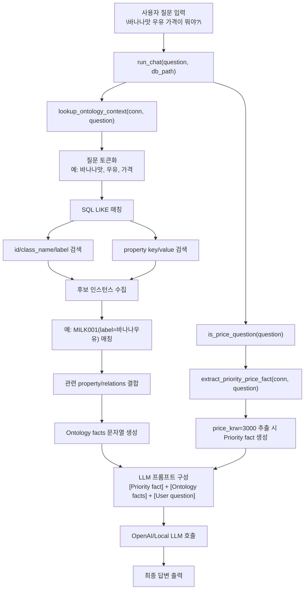

# "바나나맛 우유" 질문이 온톨로지의 "바나나우유"로 매칭되는 흐름

아래는 현재 `src/ontology_llm/app.py` 기준으로, 사용자 질문이 온톨로지 엔티티로 연결되는 과정을 시각화한 다이어그램입니다.

## 핵심 포인트
- 매칭은 `lookup_ontology_context()`에서 수행됩니다.
- 질문을 토큰으로 나눈 뒤, `label` + `properties(alias 포함)`를 `LIKE` 조건으로 조회합니다.
- 가격 질문이면 `extract_priority_price_fact()`가 `price_krw`를 우선 추출해 프롬프트 상단에 배치합니다.
- 최종적으로 LLM은 온톨로지에서 검색된 사실을 근거로 답변을 생성합니다.
