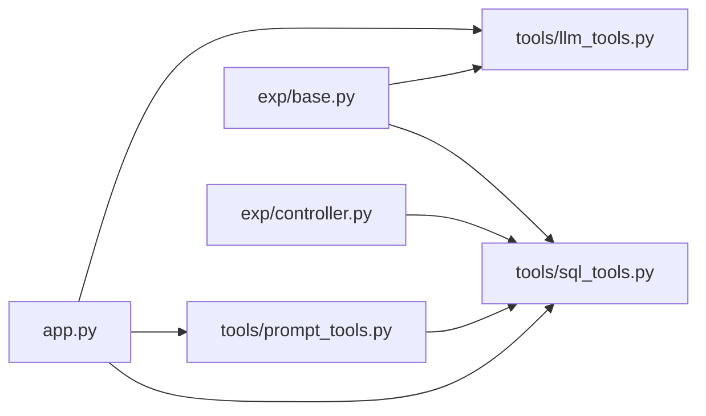

# `tools` 모듈 구조 정리

`app.py`의 SQL/헬퍼 로직을 아래 모듈로 분리한 구조입니다.

## 모듈 책임

### 1) `src/ontology_llm/tools/sql_tools.py`
- 역할: DB 연결/스키마/온톨로지 ingest/질의(SQL)
- 주요 함수:
  - `get_db(db_path)`
  - `init_schema(conn)`
  - `ingest_ontology_yaml(conn, yaml_path)`
  - `lookup_ontology_context(conn, question, limit=5)`
  - `extract_priority_price_fact(conn, question)`
  - `is_price_question(question)`
  - `extract_query_terms(question)`

### 2) `src/ontology_llm/tools/prompt_tools.py`
- 역할: 프롬프트 길이 예산/압축/토큰 추정/로깅
- 주요 함수:
  - `compress_ontology_context(...)`
  - `estimate_prompt_budget(...)`
  - `log_prompt_budget(metrics)`
  - `estimate_token_len(text, embedding_model)`
  - `get_env_int(name, default, minimum=1)`
  - `get_prompt_budget_mode()`
  - `get_memori_embedding_model()`

### 3) `src/ontology_llm/tools/llm_tools.py`
- 역할: LLM 클라이언트 구성 + Memori 연결
- 주요 함수:
  - `build_client()`
  - `attach_memori(client, sqlite_path)`
  - `get_env(name, default=None)`

## 사용 위치
- `src/ontology_llm/app.py`
  - 메인 오케스트레이션
  - `init-db`, `ingest`, `chat`, `exp` CLI 서브커맨드
- `src/ontology_llm/exp/base.py`
  - 공통 실험 실행 유틸
- `src/ontology_llm/exp/controller.py`
  - 실험 컨트롤러 + auto-ingest

## 의존 흐름

## 설계 포인트
- SQL 질의 로직과 LLM 호출 로직을 분리해 테스트/수정 범위를 축소
- 프롬프트 예산 로직을 별도 모듈로 분리해 토큰 초과 대응 정책을 독립 관리
- `app.py`는 실행 흐름 중심으로 유지
